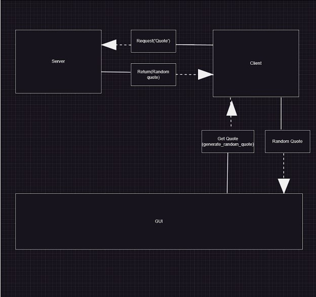

# pythonProject6

Part 2:

Add a README to your GitHub (or update it if you already have one) that contains your communication contract. (Once you define it, don't change it! Your partner is relying on you.) README must contain...
Clear instructions for how to programmatically REQUEST data from the microservice you implemented. Include an example call.
Clear instructions for how to programmatically RECEIVE data from the microservice you implemented.
UML sequence diagram showing how requesting and receiving data works. Make it detailed enough that your partner (and your grader) will understand.

Using python sockets set up a client (I have created the server). Once you have created the client, you can send a message to the server to receive and random quote.

How to request data from the microservice:

For example, currently you would run RandomServer.py, and my example is RandomClient.py, once RandomServer is running, you would send a message from RandomClient.py that says 'quote', this will have the RandomServer.py send back a random quote. 
-Run RandomServer.py
-Using sockets connect to the RandomServer.py
-Connect from your client to RandomServer.py using the same {HOST} and {PORT} specified in RandomServer.py
-From your created client send the message 'quote' (the 'quote' needs to be sent as a byte), this will send a request to the RandomServer.py
-RandomServer.py will receive 'quote', and return a randomly generated quote as bytes which the client will needs to decode the message in your created client in order to receive the quote

***BELOW IS AN EXAMPLE IN PYTHON**
import socket

HOST = "127.0.0.1"  # The server's hostname or IP address
PORT = 2259  # The port used by the server

RandomSocket = socket.socket(socket.AF_INET, socket.SOCK_STREAM)
RandomSocket.connect((HOST, PORT))

quote = b'quote'
RandomSocket.sendall(quote)

***********************************

How to receive data from the microservice:

import socket

HOST = "127.0.0.1"  # The server's hostname or IP address
PORT = 2259  # The port used by the server

RandomSocket = socket.socket(socket.AF_INET, socket.SOCK_STREAM)
RandomSocket.connect((HOST, PORT))

data = RandomSocket.recv(1024).decode()

************************************
